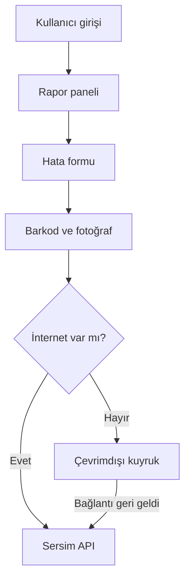

<div align="center">

# Sersim Üretim Hata Takip

### Üretim sahası için mobil hata kayıt ve raporlama uygulaması

Barkod, hata kodu ve fotoğraf bilgilerini kullanarak üretim hatalarının sahadan
hızlı biçimde kaydedilmesini, izlenmesini ve API ile senkronize edilmesini sağlar.


</div>

## Proje hakkında

Sersim Üretim Hata Takip, üretim hattında tespit edilen kusurların mobil cihazdan
raporlanması için geliştirilmiş bir Expo/React Native uygulamasıdır. Kullanıcılar
ürün barkodunu kamerayla okuyabilir, hata kodu seçebilir, fotoğraf ekleyebilir ve
raporu merkezi servise gönderebilir.

Uygulama ağ bağlantısını takip eder. Gönderilemeyen kayıtlar cihazda çevrimdışı
kuyruğa alınabilir ve bağlantı yeniden kurulduğunda API ile senkronize edilebilir.

## Özellikler

- Kullanıcı girişi ve Bearer token tabanlı API erişimi
- `SuperAdmin` ve `User` rolleri için rol bazlı yönlendirme
- Kamera üzerinden barkod/QR kod okuma
- Hata raporuna birden fazla fotoğraf ekleme ve önizleme
- API'den dinamik hata kodu ve üretim hattı bilgisi alma
- Günlük, haftalık ve toplam rapor istatistikleri
- Son raporları listeleme ve yenilemek için aşağı çekme
- İnternet durumunu gerçek zamanlı izleme
- Başarısız gönderimler için çevrimdışı kuyruk
- Bağlantı geldiğinde otomatik senkronizasyon
- Açık ve koyu tema desteği
- Android, iOS ve web hedefleri

## Uygulama akışı



## Teknoloji yığını

| Alan | Teknolojiler |
|---|---|
| Mobil uygulama | React Native 0.79, React 19, Expo 53 |
| Dil | TypeScript 5.8 |
| Navigasyon | Expo Router |
| Stil | NativeWind, Tailwind CSS |
| API istemcisi | Axios |
| Kimlik bilgisi | Expo SecureStore, JWT decode |
| Yerel veri | AsyncStorage |
| Ağ takibi | React Native NetInfo |
| Kamera ve medya | Expo Camera, Expo Image Picker |
| İkonlar | Lucide React Native |

## Depo yapısı

GitHub deposunda kaynak proje `sonsersim.zip` arşivi içinde bulunmaktadır:

```text
factory-defect-tracker-main/
├── app/                    # Expo Router ekranları ve yönlendirme
│   ├── (auth)/             # Giriş ekranı
│   └── (tabs)/             # Ana panel ve profil
├── components/             # Form, rapor kartları ve UI bileşenleri
├── contexts/               # Kimlik doğrulama ve bildirim durumları
├── hooks/                  # Tema yardımcıları
├── services/               # API, auth, depolama ve offline kuyruk
├── types/                  # TypeScript veri tipleri
├── assets/                 # Logo, ikon ve açılış görselleri
├── app.json                # Expo yapılandırması
└── package.json            # Komutlar ve bağımlılıklar
```

## Gereksinimler

- Node.js 18 veya üzeri
- npm
- Expo Go veya Android/iOS emülatörü
- Uygulamanın beklediği uçları sağlayan Sersim backend API'sine erişim

## Kurulum

### 1. Depoyu klonlayın

```bash
git clone https://github.com/karligorkem/sersimstaj.git
cd sersimstaj
```

### 2. Kaynak kodu çıkarın

PowerShell:

```powershell
Expand-Archive -LiteralPath .\sonsersim.zip -DestinationPath . -Force
cd .\factory-defect-tracker-main
```

Linux/macOS:

```bash
unzip sonsersim.zip
cd factory-defect-tracker-main
```

### 3. Bağımlılıkları yükleyin

```bash
npm install
```

### 4. Uygulamayı başlatın

```bash
npm run dev
```

Expo terminalinden QR kodu Expo Go ile okutabilir veya ilgili platform komutunu
kullanabilirsiniz:

```bash
npm run android
npm run ios
npm run web
```

## API yapılandırması

API temel adresi aşağıdaki dosyada tanımlanır:

```text
services/api.ts
```

Geliştirme veya test ortamında `baseURL` değerini kullanılacak backend adresine
göre düzenleyin. Uygulama isteklerde SecureStore içindeki erişim anahtarını
otomatik olarak `Authorization: Bearer <token>` başlığına ekler.

> Backend uygulaması bu depoya dahil değildir. Giriş, kullanıcılar, formlar,
> hata kodları, üretim hatları ve fotoğraf yükleme uçlarının sunucu tarafında
> çalışır durumda olması gerekir.

## Hata raporu alanları

Bir üretim hata kaydı temel olarak şu bilgileri içerir:

| Alan | Açıklama |
|---|---|
| Barkod | Kamera ile okutulan veya elle girilen ürün kodu |
| Ürün tipi | Raporlanan ürünün türü |
| Bant numarası | Üretim hattı bilgisi |
| Hata kodu | API'den alınan hata türü |
| Açıklama | Hata hakkında ek not |
| Fotoğraflar | Kusuru gösteren en az bir görsel |

## Güvenlik notları

- Erişim anahtarı `expo-secure-store` içinde saklanır.
- `401 Unauthorized` yanıtında yerel token silinir ve kullanıcı girişe yönlendirilir.
- API adresi dışında parola veya erişim anahtarı kaynak koda yazılmamalıdır.
- Üretim ortamında HTTPS, kısa ömürlü token ve sunucu taraflı rol kontrolü kullanılmalıdır.

## Bilinen sınırlamalar

- Backend kaynak kodu ve API kurulumu bu depoda bulunmaz.
- Kaynak kod şu anda ZIP arşivi içinde dağıtılmaktadır.
- Bazı üretim hattı/form varsayılanları gerçek ortam için ayrıca yapılandırılmalıdır.
- Çevrimdışı senkronizasyon üretime alınmadan önce ağ kesintisi ve tekrar gönderim
  senaryolarında uçtan uca test edilmelidir.

## Geliştirici

**Görkem Karlı**

Bilgisayar mühendisliği staj çalışması kapsamında geliştirilen mobil üretim hata
takip ve raporlama uygulaması.

## Lisans

Bu proje için henüz açık kaynak lisansı tanımlanmamıştır.
